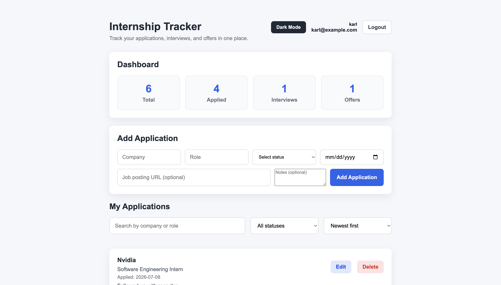
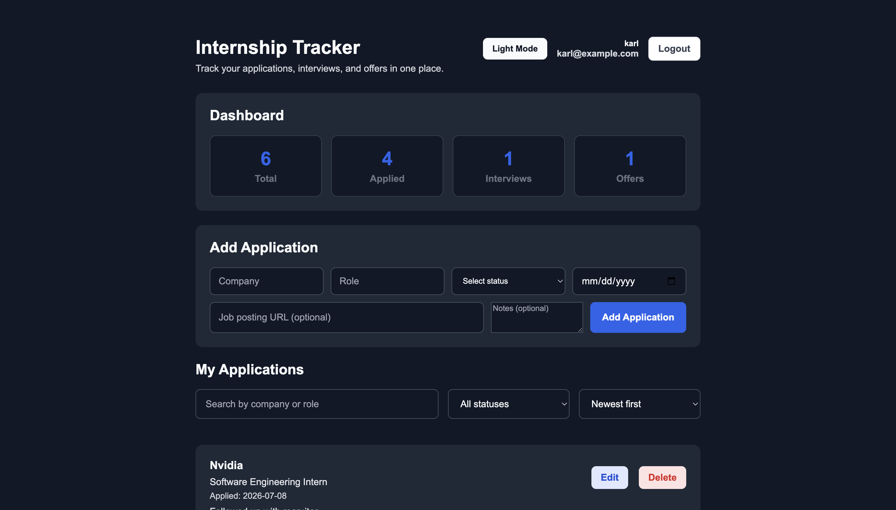
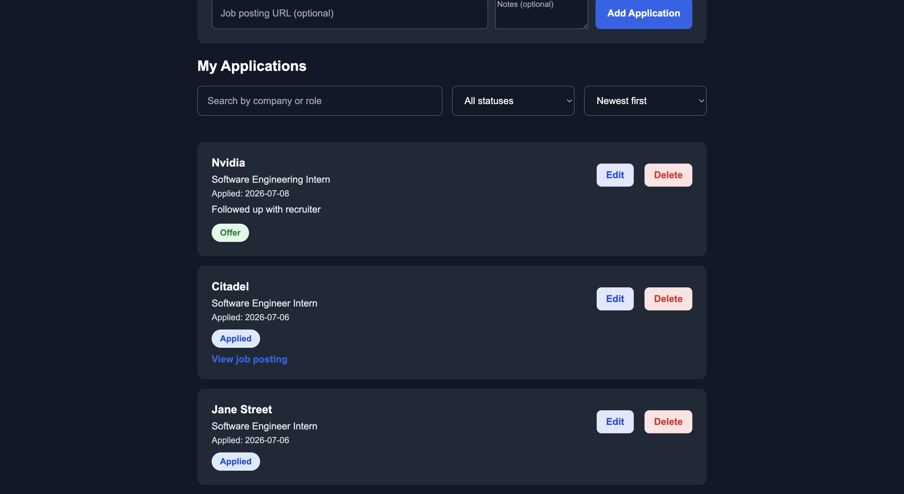
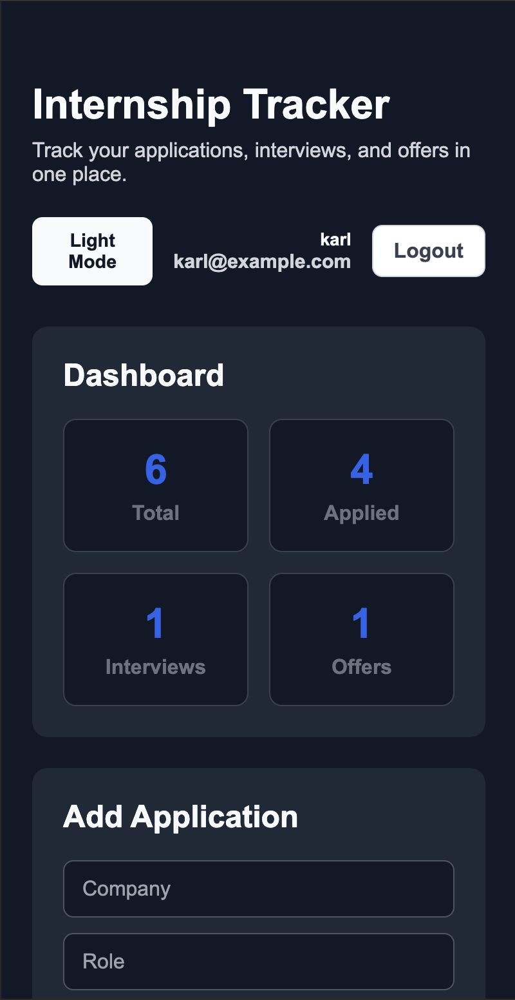
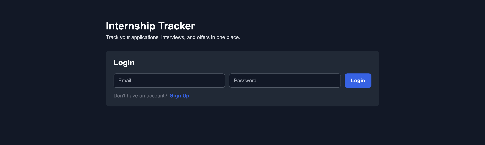

# Internship Tracker

A full-stack web application for tracking internship applications throughout the job search process. Users can create an account, securely log in, and manage their own applications with status tracking, notes, dates, job posting links, search, filtering, sorting, and dashboard statistics.

## Live Demo

- Frontend: https://internship-tracker-frontend-95sv.onrender.com
- Backend API: https://internship-tracker-api-thqo.onrender.com
- API Documentation: https://internship-tracker-api-thqo.onrender.com/docs

> The application is hosted on Render's free tier, so the first request may take a short time while the services wake up.

## Screenshots

### Light Mode



### Dark Mode



### Application Cards



### Mobile View



### Login



## Features

- User signup and login
- Secure password hashing
- JWT-based authentication
- User-specific application data
- Create, view, edit, and delete internship applications
- Track company, role, status, applied date, notes, and job posting URL
- Clickable links to original job postings
- Dashboard statistics for total applications, applied roles, interviews, and offers
- Search applications by company or role
- Filter applications by status
- Sort applications by newest or oldest applied date
- Logged-in username and email display
- Dark and light modes with saved theme preference
- Persistent login using localStorage
- Loading states and toast notifications
- Delete confirmation
- Duplicate submission prevention
- Responsive mobile layout
- PostgreSQL database in production
- SQLite database for local development
- Deployed frontend and backend

## Tech Stack

### Frontend

- React
- Vite
- JavaScript
- CSS

### Backend

- FastAPI
- Python
- JWT
- bcrypt password hashing
- PostgreSQL
- SQLite

### Deployment

- Render

## How It Works

The React frontend communicates with a FastAPI REST API. After logging in, the client stores the user's JWT access token and sends it with protected API requests. The backend uses the authenticated user ID to ensure each user can only access and modify their own internship applications.

The application uses PostgreSQL in production and SQLite for local development.

## Project Structure

This project is split into two repositories:

- Frontend repository: https://github.com/karl-bucad/internship-tracker-frontend
- Backend repository: https://github.com/karl-bucad/internship-tracker-api

## Running Locally

### Frontend

Clone the frontend repository:

```bash
git clone https://github.com/karl-bucad/internship-tracker-frontend.git
cd internship-tracker-frontend
npm install
npm run dev
```

### Backend

Clone the backend repository:

```bash
git clone https://github.com/karl-bucad/internship-tracker-api.git
cd internship-tracker-api
```

Create and activate a virtual environment:

```bash
python -m venv venv
source venv/bin/activate
```

Install dependencies:

```bash
pip install -r requirements.txt
```

Start the API:

```bash
uvicorn main:app --reload
```

The local API documentation will be available at:

```text
http://127.0.0.1:8000/docs
```

## Future Improvements

- Add interview dates and application deadlines
- Add analytics charts and application trends
- Add password reset functionality
- Add email verification
- Add pagination for large application lists

## Author

Karl Bucad